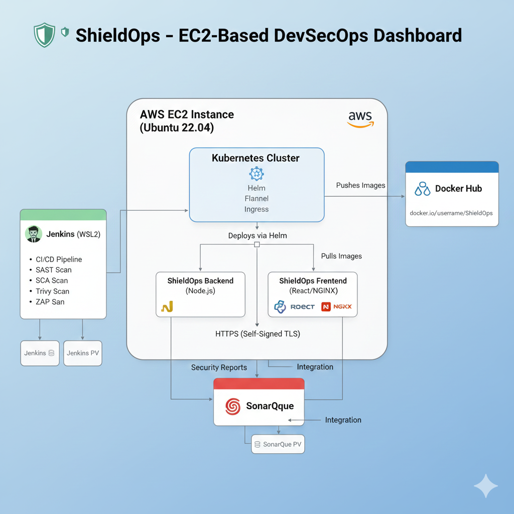

# 🛡️ ShieldOps — DevSecOps Dashboard

[](#)
[](https://hub.docker.com/r/gauravchile/shieldops)
[](#)
[](#)
[](#)
[](#)

---

**ShieldOps** is a full-stack **DevSecOps Dashboard** automating:

* **SAST**, **SCA**, **DAST**, and **Container Image Scanning**
* Integrated **CI/CD pipeline** (Jenkins → Docker Hub → Kubernetes via Helm)
* Automated cluster provisioning via `shieldops-cluster-bootstrap.sh`
* Deployed on **AWS EC2** with **Ingress-NGINX** and **VPA** for autoscaling

---



---

## ⚡ Quickstart

### 🧰 Prerequisites

| Requirement | Version / Tool           |
| ----------- | ------------------------ |
| Ubuntu      | 22.04+ (EC2 Recommended) |
| Docker      | 25.x+                    |
| Node.js     | 20+                      |
| Helm        | 3.x                      |
| Kubernetes  | v1.31+                   |

---

### 🔐 Environment Variables

#### Backend (`.env`)

```bash
PORT=8081
JWT_SECRET=change-me-super-secret
TOKEN_EXPIRY=4h
```

#### Frontend (`ui/.env`)

```bash
echo "VITE_API_BASE_URL=/api" > ui/.env
```

---

### Script Usage

```bash
sudo ./shieldops-cluster-bootstrap.sh --help
```

### Setup

```bash
sudo chmod +x shieldops-cluster-bootstrap.sh --master <DockerHUB Username>
```

### Permission
# 1) Give Current User kubeconfig
```bash
sudo install -d -m 700 /home/"${USER}"/.kube
sudo cp /etc/kubernetes/admin.conf /home/"${USER}"/.kube/config
sudo chown "${USER}":"${USER}" /home/"${USER}"/.kube/config
chmod 600 /home/"${USER}"/.kube/config
```

# 2) Stop pointing at the root-only file
```bash
unset KUBECONFIG
```

# 3) Test
```bash
kubectl get nodes
kubectl get pods -A
```
### Jenkins Permissions

```bash
sudo usermod -aG docker jenkins
```
```bash
echo 'export PATH=$PATH:/home/ubuntu/.local/bin' | sudo tee -a /etc/profile.d/jenkins_path.sh
sudo systemctl restart jenkins
```
### Docker Login

```bash
docker login -u <username>
```


### Build & Push Images

```bash
sudo ./shieldops-cluster-bootstrap.sh --master --deploy
```
 
### JWT_SECRET GENERATION (Change in values.yaml & values-ci.yaml) (Optional)

```bash
kubectl create secret generic shieldops-secrets \
  --from-literal=jwtSecret=$(openssl rand -base64 32) \
  -n shieldops
```

### Deploy

```bash
sudo ./shieldops-cluster-bootstrap.sh --master --deploy
```

**Access the Dashboard →** http://<Server-Ip>:<NodePort>  🛡️

---

### 🌐 Expected Public Access Points

| Component                | Port                                    | Description             |
| ------------------------ | --------------------------------------- | ----------------------- |
| Jenkins Dashboard        | `http://<EC2-Public-IP>:8080`           | CI/CD pipeline access   |
| ShieldOps Dashboard (UI) | `http://<EC2-Public-IP>:<NodePort>`     | Frontend via Ingress    |
| ShieldOps API            | `http://<EC2-Public-IP>:<NodePort>/api` | Backend API via Ingress |
| HTTPS (Optional)         | `https://<EC2-Public-IP>:<NodePort>`    | Secure ingress endpoint |


### Patch the ingress controller Service
```bash
kubectl -n ingress-nginx patch svc ingress-nginx-controller \
  --type merge \
  -p '{
    "spec": {
      "type": "NodePort",
      "ports": [
        {"name": "http", "port": 80, "targetPort": 80, "nodePort": 30080},
        {"name": "https", "port": 443, "targetPort": 443, "nodePort": 30443}
      ]
    }
  }'
```

```bash
kubectl get svc -n ingress-nginx
```

## ☸️ Project Overview

## 🔐 DevSecOps Stack

| Stage          | Tool / Command                                            | Purpose                                                      |
| -------------- | --------------------------------------------------------- | ------------------------------------------------------------ |
| **SAST**       | **CodeQL**                                                | Static code & security analysis                              |
| **SCA**        | **OWASP Dependency-Check**, **Safety**, **CycloneDX BOM** | Dependency & package vulnerability scanning, SBOM generation |
| **Image Scan** | **Trivy**                                                 | Container image vulnerability scanning                       |
| **DAST**       | **OWASP ZAP**                                             | Dynamic application security testing                         |

---

### 🧩 Core Components

| Component       | Stack                      | Description                               |
| --------------- | -------------------------- | ----------------------------------------- |
| **Backend**     | Node.js + Express          | JWT Auth, RBAC, REST APIs                 |
| **Frontend**    | React + Vite + TailwindCSS | Modern cyber dashboard UI                 |
| **Infra**       | Helm + Kubernetes + NGINX  | Automated deployment & ingress            |
| **Pipeline**    | Jenkins                    | Full CI/CD automation with security gates |
| **Autoscaling** | VPA                        | Automatic pod CPU/memory adjustment       |

---

## 📁 Project Structure

```
ShieldOps/
├── Jenkinsfile                      # CI/CD pipeline
├── README.md                        # Documentation
├── Screenshots/ArchitectureDiagram.png
├── aggregator/aggregate.sh          # Security report aggregator
├── backend/                         # Node.js backend (JWT, RBAC)
│   ├── Dockerfile
│   ├── package.json
│   ├── src/
│   │   ├── routes/, middleware/, server.js, etc.
│   └── users.json
├── ui/                              # React + Tailwind frontend
│   ├── src/components, pages, hooks
│   └── vite.config.ts
├── helm/ShieldOps/                  # Helm chart for UI + API + Ingress
│   ├── templates/*.yaml
│   └── values.yaml
├── docker-compose.yml               # Local test deployment
├── nginx.conf                       # NGINX config for UI
└── shieldops-cluster-bootstrap.sh   # Cluster & Helm bootstrap script
```
---

## 🧠 Tech Stack Summary

| Layer        | Tools                                         |
| ------------ | --------------------------------------------- |
| **CI/CD**    | Jenkins, Docker, Helm                         |
| **Security** | SonarQube, OWASP ZAP, Trivy, Dependency-Check |
| **Backend**  | Node.js, Express, PostgreSQL                  |
| **Frontend** | React, Vite, TailwindCSS, Recharts            |
| **Infra**    | Kubernetes, containerd, Ingress-NGINX, VPA    |
| **Platform** | AWS EC2                                       |

---

## ✅ Verification

After deployment, verify core system components:

```bash
kubectl get pods -A
kubectl get ing -A
kubectl get vpa
kubectl get pods -n kube-system | grep vpa
```

Expected output:

```
vpa-admission-controller-xxxxx   1/1   Running
vpa-recommender-xxxxx            1/1   Running
vpa-updater-xxxxx                1/1   Running
```

---

## 🚀 Future Enhancements

* Prometheus + Grafana for observability
* Cert-Manager for automated TLS
* Loki + Promtail centralized logging
* Cosign for container image signing
* Slack alert integrations

---

